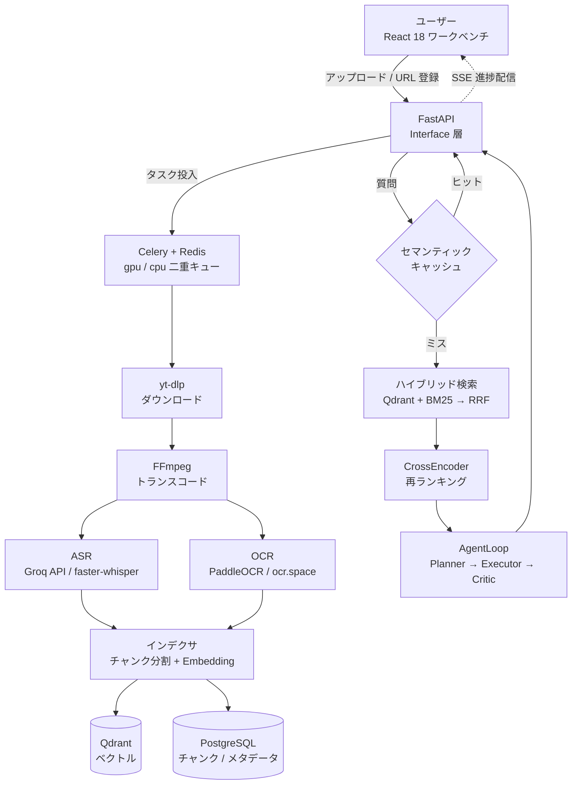

<div align="center">

# VideoMind

**動画を「検索できる知識」に変える、Agentic RAG 動画理解プラットフォーム**

動画をアップロードする → ASR + OCR で文字起こし → ハイブリッド検索 → 自社開発 AgentLoop による多段階分析 → タイムスタンプ付きエビデンスで根拠を示す

[](https://www.python.org/)
[](https://fastapi.tiangolo.com/)
[](https://docs.celeryq.dev/)
[](https://react.dev/)
[](https://github.com/zhudalai/videomind-python/actions/workflows/ci.yml)
[](https://github.com/zhudalai/videomind-python/actions/workflows/ci.yml)
[](LICENSE)

</div>

---

## 📌 概要

VideoMind は、動画を**時間軸付きで検索・質問応答できるナレッジベース**に変換するフルスタック Web アプリケーションです。

一般的な RAG がテキスト文書を対象とするのに対し、本プロジェクトは**動画という非構造化データ**を扱います。音声（ASR）と画面文字（OCR）を二重に抽出して統合インデックスを構築し、Agent が多段階で分析した結論を**必ず元動画のタイムスタンプ付きで引用**します。

バックエンドは FastAPI + Celery + PostgreSQL + Redis + Qdrant、フロントエンドは React 18 + TypeScript。Docker Compose でローカル完結して動作します。

> ℹ️ **個人開発のため、デプロイ済みの公開 URL はありません。** 動作は下記スクリーンショットでご確認ください。

<table>
  <tr>
    <td align="center"><b>ダッシュボード</b></td>
    <td align="center"><b>RAG チャット（タイムスタンプ引用）</b></td>
    <td align="center"><b>Agent 分析ワークベンチ</b></td>
  </tr>
  <tr>
    <td align="center"></td>
    <td align="center"></td>
    <td align="center"></td>
  </tr>
</table>

---

## 💡 開発背景・解決する課題

**課題：動画は「見る」ことはできても「検索する」ことができない。**

技術カンファレンスのアーカイブ、オンライン講座、勉強会の録画など、学習目的の動画コンテンツは年々増えています。しかし既存の動画プラットフォームには以下の不便さがありました。

| 課題 | 既存ツールでの限界 |
|---|---|
| 「あの説明は動画のどの辺だったか」を探せない | タイムスタンプへのジャンプは手動シークのみ |
| 動画を横断した比較ができない | 動画ごとに独立しており、複数動画をまたぐ質問ができない |
| 画面に映った資料の文字が検索対象外 | 字幕（音声）のみが対象で、スライドや図中の文字は無視される |
| 結論の根拠が確認できない | 生成 AI の回答がどの発言に基づくか追跡できない |

**解決アプローチ**

1. **音声と画面の両方をテキスト化** — ASR と OCR の結果を時間軸で統合
2. **ハイブリッド検索** — ベクトル検索と BM25 を RRF で融合
3. **エビデンス強制** — すべての結論に `timestampMs + source(ASR|OCR) + 原文` を紐付け
4. **完全ローカル動作** — 外部 API なしでもパイプライン全体が動作

技術的な学習テーマとしても、**RAG・Agent 設計・非同期タスク・キャッシュ戦略・可観測性**を一つのアプリケーションの中で一貫して実装することを狙いました。

---

## 🚀 主要機能

| 機能 | 概要 |
|---|---|
| **動画取り込み** | URL / ファイルアップロード → ダウンロード → トランスコード → ASR → OCR → インデックス構築 |
| **ハイブリッド検索** | Qdrant（ベクトル）+ BM25 → RRF 融合 → CrossEncoder 再ランキング |
| **RAG 質問応答** | 意図判定 → クエリ書き換え → 検索 → タイムスタンプ付き引用で回答（SSE ストリーミング） |
| **AgentLoop 分析** | Planner → Executor → Critic の多段階ループ。最大 4 動画の横断比較、チェックポイントで中断復帰 |
| **セマンティックキャッシュ** | 完全一致 + 意味的類似の二段構成で LLM 呼び出しを削減 |
| **リアルタイム進捗** | Celery ワーカーの処理状況を Redis Pub/Sub 経由で SSE 配信 |

---

## 🏗 システム構成



---

## 🛠 技術スタック

**バックエンド** — Python 3.11+ / FastAPI / Uvicorn / Celery 5.4 + Redis / PostgreSQL + pgvector / Qdrant / MinIO / faster-whisper・Groq API / PaddleOCR・ocr.space / sentence-transformers (BAAI/bge-m3)

**フロントエンド** — React 18 / TypeScript / Vite / TailwindCSS / Radix UI / TanStack Query / Recharts

**インフラ・開発基盤** — Docker Compose / GitHub Actions / pytest・pytest-asyncio・hypothesis / uv / structlog・Prometheus・OpenTelemetry

### ⚖️ 技術選定の理由（抜粋）

| 選定 | 理由 |
|---|---|
| **FastAPI** | 動画処理は「タスク投入 → 進捗配信」という非同期中心のワークロードです。`async/await` がネイティブで SSE を追加ライブラリなしに実装でき、Pydantic の型定義から OpenAPI が自動生成される点もフロントエンドとの契約維持に有効でした。 |
| **Celery + Redis** | ASR は CPU/GPU を数十秒〜数分占有するため HTTP リクエスト内では処理できません。**GPU を使う処理と使わない処理を別キューに分離**し、並列度を独立に制御しています。Redis はキャッシュで既に利用していたため、broker/backend を追加導入せずに済みました。 |
| **Qdrant + BM25 の併用** | ベクトル検索のみでは人名・型番・専門用語のような**固有名詞の完全一致に弱く**、BM25 のみでは言い換え表現を拾えません。両者を RRF で融合し弱点を補完しています。 |
| **PostgreSQL + pgvector** | 「どのチャンクがどの動画のどの時刻か」という参照整合性が重要なため、ベクトル DB を完全分離せず併用しています（Qdrant を高速検索用、PostgreSQL を正となる記録用とした**二重書き込み**）。 |

---

## ✨ 技術的なこだわり

### 1. API / ローカル二重推論による可用性担保

ASR・OCR・Embedding はいずれも `local` / `api` を環境変数で切り替え可能な二重構成です。API 障害やレート制限時にはローカル推論へ自動フォールバックし、外部サービスに依存せずパイプライン全体が動作します。

### 2. RRF + CrossEncoder によるハイブリッド検索

ベクトル検索（意味的類似）と BM25（キーワード一致）を **RRF（Reciprocal Rank Fusion）** で融合し、**CrossEncoder** で再ランキングします。固有名詞の完全一致と言い換え表現の双方を取りこぼしません。

### 3. AgentLoop による多段階分析

`Planner → Executor → Critic` の自社開発ループにより、複数動画を横断した比較分析を行います。Critic が根拠不足と判定した結論は棄却され、すべての結論にタイムスタンプ付きエビデンスが必須です。処理は Celery ワーカー上で実行され、チェックポイントにより中断・復帰に対応します。

### 4. 2 段階セマンティックキャッシュ

完全一致（Exact Match）とベクトル類似度（Vector Similarity）の二段構成により、同一・類似質問での LLM 呼び出しを削減します。キャッシュ障害時は通常フローへ透過的にフォールバックします（fail-open）。

---

## 🧪 テスト・品質

**core 層カバレッジ 90.1%**（CI で 80% ゲートを強制）/ 単体テスト 556 件

```bash
uv run pytest -m "not e2e and not infra" --cov=src/videomind/core --cov-fail-under=80
```

- **GitHub Actions による CI 自動化** — カバレッジ 90% 以上を維持
- **Property-based Testing (Hypothesis)** による境界値検証
- **外部依存はすべてモック化** — Redis / MinIO / Qdrant / 推論モデルを差し替え、実インフラなしで高速実行
- テスト駆動で発見した不具合は、すべて回帰テストとして保持

---

## 🚀 ローカル起動

前提: Docker / Python 3.11+ と [uv](https://github.com/astral-sh/uv) / Node.js 18+ / FFmpeg（`PATH` 上）

```bash
# 1. クローン + 依存関係
git clone https://github.com/zhudalai/videomind-python.git && cd videomind-python
uv sync

# 2. 環境変数（ASR/OCR/Embedding の provider・API キーを必要に応じて記入）
cp .env.example .env

# 3. インフラ起動（Postgres / Redis / Qdrant / MinIO）
docker compose -f docker/docker-compose.yml up -d
alembic upgrade head

# 4. API 起動
uv run uvicorn videomind.interface:app --reload --port 8011

# 5. Celery Worker 起動（別ターミナル）
#    ※ Windows では -P solo が必須（prefork は _loc race でハングします）
uv run celery -A videomind.application.task_orchestration.celery worker -Q gpu -c 1 -P solo
uv run celery -A videomind.application.task_orchestration.celery worker -Q cpu -c 4 -P solo

# 6. フロントエンド起動（別ターミナル）
cd frontend && npm install && npm run dev
```

- 📖 API ドキュメント: http://localhost:8011/docs
- 🖥️ フロントエンド: http://localhost:4000

主な設定項目は `.env` から注入されます（全項目は [.env.example](.env.example) 参照）。

| 変数 | 値 | 説明 |
|---|---|---|
| `ASR_PROVIDER` | `local` \| `api` | local=faster-whisper、api=Groq |
| `OCR_PROVIDER` | `local` \| `api` | local=PaddleOCR、api=ocr.space |
| `EMBEDDING_PROVIDER` | `local` \| `api` | local=sentence-transformers、api=Ollama/OpenAI |
| `RERANK_PROVIDER` | `off` \| `api` \| `local` | off=固定重み、api=OpenRouter、local=BGE-reranker |
| `SEMANTIC_CACHE_ENABLED` | `true` \| `false` | セマンティックキャッシュの有効化 |

---

## 🔮 今後の展望

- [ ] **デプロイ環境の整備** — クラウド環境（AWS 等）へのデプロイと公開デモの用意
- [ ] **フロントエンドのテスト追加** — vitest の設定は完了、テストケースが未実装
- [ ] **長尺動画の分割転写（チェックポイント対応）** — 音声分割は実装済み、中断復帰の本番経路への接続が未完了
- [ ] **モデルゲートウェイの Redis 化** — サーキットブレーカーの状態をプロセス内メモリから複数ワーカー間で共有できるようにする

---

## 📚 設計ドキュメント

設計判断の詳細は [docs/](docs/) にまとめています。

| ドキュメント | 内容 |
|---|---|
| [ARCHITECTURE.md](docs/ARCHITECTURE.md) | 全体構成、データフロー、技術選定理由、GPU スケジューリング |
| [DATA-MODEL.md](docs/DATA-MODEL.md) | テーブル定義、ER 図、インデックス戦略、マイグレーション |
| [VIDEO-PIPELINE.md](docs/VIDEO-PIPELINE.md) | ダウンロード → トランスコード → セグメント ASR → キーフレーム OCR → 結合 |
| [RAG-RETRIEVAL.md](docs/RAG-RETRIEVAL.md) | ハイブリッド検索、RRF 融合、再ランキング、引用追跡 |
| [AGENT-LOOP.md](docs/AGENT-LOOP.md) | Planner → Executor → Critic、エビデンス検証、チェックポイント |
| [MODEL-GATEWAY.md](docs/MODEL-GATEWAY.md) | 三態サーキットブレーカー、優先度ルーティング、トークン課金 |
| [TASK-ORCHESTRATION.md](docs/TASK-ORCHESTRATION.md) | Celery + Redis、状態遷移、冪等性、リトライ予算、SSE |
| [INTENT-ROUTING.md](docs/INTENT-ROUTING.md) | 意図認識ツリー、クエリ書き換え、マルチチャネル検索 |
| [FRONTEND.md](docs/FRONTEND.md) | ルーティング、状態管理、API 層、SSE 進捗、画面構成、テスト |
| [SECURITY.md](docs/SECURITY.md) | JWT 認証、API キーの AES-GCM 暗号化、レート制限、監査ログ |
| [OBSERVABILITY.md](docs/OBSERVABILITY.md) | 構造化ログ、Prometheus、トレーシング、評価フレームワーク |
| [DEPLOYMENT.md](docs/DEPLOYMENT.md) | Docker Compose、環境変数、GPU パススルー、ローカル展開 |
| [DECISIONS.md](docs/DECISIONS.md) | 設計上の意思決定記録（採用理由と却下理由） |

---

## 📄 ライセンス

[MIT License](LICENSE)
