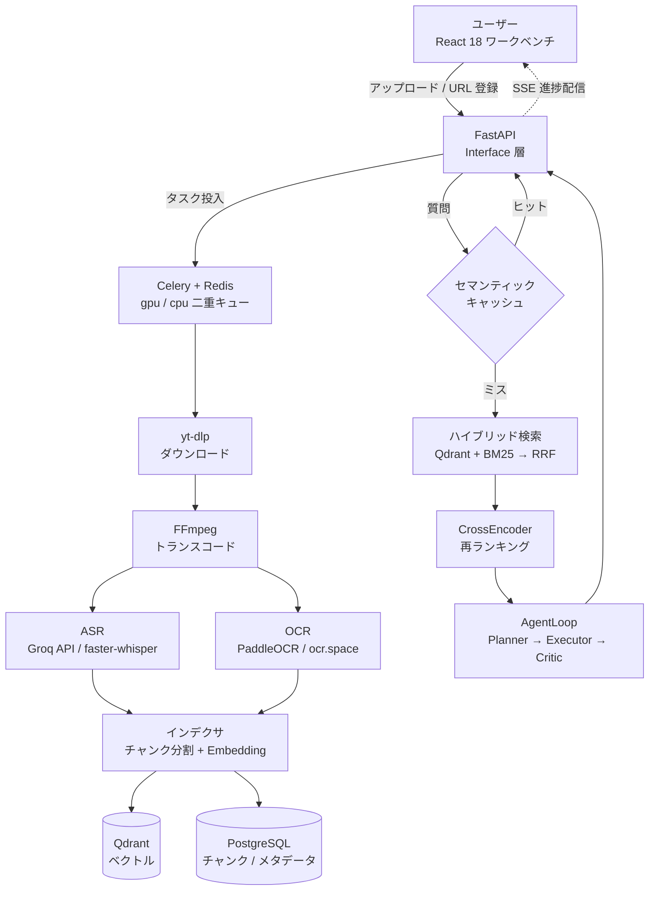

<div align="center">

# VideoMind

**動画を「検索できる知識」に変える、Agentic RAG 動画理解プラットフォーム**

動画をアップロードする → ASR + OCR で文字起こし → ハイブリッド検索 → 自社開発 AgentLoop による多段階分析 → タイムスタンプ付きエビデンスで根拠を示す

[](https://www.python.org/)
[](https://fastapi.tiangolo.com/)
[](https://docs.celeryq.dev/)
[](https://react.dev/)
[](https://github.com/zhudalai/videomind-python/actions/workflows/ci.yml)
[](https://github.com/zhudalai/videomind-python/actions/workflows/ci.yml)
[](LICENSE)

</div>

---

## 📌 プロジェクト概要

VideoMind は、動画コンテンツを**時間軸付きで検索・質問応答できるナレッジベース**に変換するフルスタック Web アプリケーションです。

一般的な RAG が「テキスト文書」を対象とするのに対し、本プロジェクトは**動画という非構造化データ**を扱います。動画から音声（ASR）と画面文字（OCR）を二重に抽出し、両者を統合したインデックスに対してハイブリッド検索を行い、Agent が多段階で分析した結論を**必ず元動画のタイムスタンプ付きで引用**します。

バックエンドは FastAPI + Celery + PostgreSQL + Redis + Qdrant、フロントエンドは React 18 + TypeScript で構成し、Docker Compose でローカル完結して動作します。

> ℹ️ **本プロジェクトは個人開発です（デプロイ済みの公開 URL はありません）。** ローカル環境で完結する構成のため、動作は下記のスクリーンショットでご確認ください。

---

## 💡 開発背景・課題意識

**課題：動画は「見る」ことはできても「検索する」ことができない。**

技術カンファレンスのアーカイブ、オンライン講座、勉強会の録画など、学習目的の動画コンテンツは年々増えています。しかし既存の動画プラットフォームでは、以下のような不便さがありました。

| 課題 | 既存ツールでの限界 |
|---|---|
| 「あの説明は動画のどの辺だったか」を探せない | タイムスタンプへのジャンプは手動シークのみ |
| 動画を横断した比較ができない | 動画ごとに独立しており、複数動画をまたぐ質問ができない |
| 画面に映った資料の文字が検索対象外 | 字幕（音声）のみが対象で、スライドや図中の文字は無視される |
| 結論の根拠が確認できない | 生成 AI の回答がどの発言に基づくか追跡できない |

**解決アプローチ：**

1. **音声と画面の両方をテキスト化** — ASR で発話を、OCR で画面文字を取り出し、時間軸で統合
2. **ハイブリッド検索** — ベクトル検索（意味的な近さ）と BM25（キーワード一致）を RRF で融合
3. **エビデンス強制** — すべての結論に `timestampMs + source(ASR|OCR) + 原文` を紐付け、検証できない回答は棄却
4. **完全ローカル動作** — 外部 API がなくてもパイプライン全体が動作し、コストと可用性を自分で制御できる

技術的な学習テーマとしても、**RAG・Agent 設計・非同期タスク・キャッシュ戦略・可観測性**を一つのアプリケーションの中で一貫して実装することを狙いました。

---

## 🚀 主要機能

| 機能 | 概要 |
|---|---|
| **動画取り込みパイプライン** | URL 登録またはファイルアップロード → yt-dlp ダウンロード → FFmpeg トランスコード → セグメント分割 ASR → キーフレーム OCR → インデックス構築 |
| **ストリーミングアップロード** | 大容量動画を 1MB 単位で分割して書き出し、読み込みながら SHA256 を算出。ファイル全体をメモリに載せない |
| **二重推論パス** | ASR / OCR / Embedding それぞれ `local` / `api` を環境変数で切替。API を主力に、ローカルをフォールバックとして保持 |
| **ハイブリッド検索** | Qdrant（BGE-M3 ベクトル）+ BM25（CJK 分かち書き対応）→ RRF 融合 → CrossEncoder 再ランキング |
| **RAG 質問応答** | 意図判定 → クエリ書き換え → マルチチャネル検索 → ストリーミング回答（SSE） |
| **セマンティックキャッシュ** | 完全一致（L1）+ 意味的類似（L2）の二段キャッシュ。同一・類似質問での LLM 再呼び出しを削減 |
| **AgentLoop 分析** | `Planner → Executor → Critic` の多段階ループ。最大 4 動画の横断比較に対応、チェックポイントで中断復帰。**処理は Celery ワーカー上で実行**されるため、API プロセス再起動時もタスクが失われない |
| **リアルタイム進捗** | Celery ワーカーの処理状況を Redis Pub/Sub 経由で SSE 配信 |
| **可観測性** | 構造化ログ（structlog）+ Prometheus メトリクス + OpenTelemetry 分散トレーシング |

<details>
<summary>📸 画面イメージ（クリックで展開）</summary>

<br>

<table>
  <tr>
    <td align="center"><b>ダッシュボード</b></td>
    <td align="center"><b>動画アップロード</b></td>
    <td align="center"><b>動画ライブラリ</b></td>
  </tr>
  <tr>
    <td align="center"></td>
    <td align="center"></td>
    <td align="center"></td>
  </tr>
  <tr>
    <td align="center"><b>動画詳細</b></td>
    <td align="center"><b>パイプライン進捗（SSE）</b></td>
    <td align="center"><b>RAG チャット</b></td>
  </tr>
  <tr>
    <td align="center"></td>
    <td align="center"></td>
    <td align="center"></td>
  </tr>
  <tr>
    <td align="center"><b>Agent 分析ワークベンチ</b></td>
    <td align="center"><b>ヘルスダッシュボード</b></td>
    <td align="center"></td>
  </tr>
  <tr>
    <td align="center"></td>
    <td align="center"></td>
    <td align="center"></td>
  </tr>
</table>

</details>

---

## 🛠 使用技術

### バックエンド

- **Python 3.11+ / FastAPI / Uvicorn** — 非同期 API・SSE ストリーミング
- **Celery 5.4 + Redis** — GPU / CPU 二重キューの非同期タスク処理
- **PostgreSQL + pgvector / Qdrant / MinIO** — メタデータ・ベクトル・オブジェクトストレージ
- **faster-whisper / Groq API** — ASR 二重パス
- **PaddleOCR / ocr.space** — OCR 二重パス
- **sentence-transformers (BAAI/bge-m3)** — 多言語 Embedding

### フロントエンド

- **React 18 / TypeScript / Vite**
- **TailwindCSS / Radix UI / TanStack Query / Zustand / React Router 6 / Recharts**

### インフラ・開発基盤

- **Docker / Docker Compose** — ストレージ系サービス（PostgreSQL / Redis / Qdrant / MinIO）
- **GitHub Actions** — 単体テスト自動実行 + カバレッジ 80% ゲート
- **pytest / pytest-asyncio / pytest-cov / hypothesis** — テスト基盤
- **uv + hatchling** — 依存解決・パッケージ管理
- **structlog / Prometheus / OpenTelemetry** — 可観測性

### ⚖️ 技術選定の理由（抜粋）

| 選定 | 理由 |
|---|---|
| **FastAPI** | 動画処理はタスク投入 → 進捗配信という非同期中心のワークロードです。`async/await` がネイティブで、SSE による進捗ストリーミングを追加ライブラリなしで実装できます。Pydantic による型定義から OpenAPI ドキュメントが自動生成される点も、フロントエンドとの契約を保つ上で有効でした。 |
| **Celery + Redis** | Whisper による文字起こしは CPU/GPU を数十秒〜数分占有するため、HTTP リクエスト内では処理できません。**GPU を使う処理（ASR/OCR）と使わない処理（ダウンロード/インデックス）を別キューに分離**し、ワーカー数と並列度を独立に制御できる構成にしました。既に Redis をキャッシュで利用していたため、broker/backend を追加導入せずに済む点も決め手でした。 |
| **Qdrant + BM25 の併用** | ベクトル検索のみでは、人名・型番・専門用語のような**固有名詞の完全一致に弱い**という問題があります。逆に BM25 のみでは言い換え表現を拾えません。両者を RRF（Reciprocal Rank Fusion）で融合することで、それぞれの弱点を補完しています。Qdrant は Payload フィルタ（動画 ID 絞り込み）が強く、単一ノードで運用できる点も要件に合致しました。 |
| **PostgreSQL + pgvector** | メタデータ・タスク状態・チャンクを RDB で一貫管理しつつ、pgvector によりベクトルも同一トランザクション境界で扱えます。「どのチャンクがどの動画のどの時刻か」という参照整合性が重要なため、ベクトル DB を完全に分離せず併用する構成としました（Qdrant は高速検索用、PostgreSQL は正となる記録用として**二重書き込み**）。 |

---

## 🏗 システム構成図

### データフロー



### レイヤ構成

```
┌──────────────────────────────────────────────────────────────────┐
│  Interface 層 · FastAPI + SSE リアルタイム進捗 / OpenAPI ドキュメント│
├──────────────────────────────────────────────────────────────────┤
│  Application 層 · Celery タスクオーケストレーション + GPU 管理 + 状態/冪等│
├──────────────────────────────────────────────────────────────────┤
│  Core 層 · 動画パイプライン / RAG 検索 / 意図ルーティング /     │
│        AgentLoop / モデルゲートウェイ                              │
│   ├─ video_pipeline  ASR(local+api) OCR(local+api) セグメント結合  │
│   ├─ rag             Qdrant+BM25→RRF→CrossEncoder→引用追跡         │
│   ├─ intent          意図認識ツリー + クエリ書き換え + マルチチャネル検索│
│   ├─ agent_loop      Planner→Executor→Critic + エビデンス検証      │
│   └─ model_gateway   三態ブレーカー + 優先度ルーティング + 初回パケット検知│
├──────────────────────────────────────────────────────────────────┤
│  Infrastructure 層 · Postgres+pgvector / Qdrant / MinIO / Redis   │
├──────────────────────────────────────────────────────────────────┤
│  Observability · structlog + Prometheus + OpenTelemetry トレーシング│
└──────────────────────────────────────────────────────────────────┘
```

---

## ✨ こだわった点・技術的工夫

### 1. 二重推論パスによる可用性とコストの両立

ASR / OCR / Embedding の各推論に `*_PROVIDER` 環境変数（`local` | `api`）を設け、**同一インターフェースのまま環境変数だけでバックエンドを切り替え**られる設計にしました。本番相当では API（Groq `whisper-large-v3-turbo`）を主力としつつ、ネットワーク断やレート制限時にはローカル推論へ自動フォールバックします。

単なる「if 分岐」ではなく、**フォールバックしてよい失敗と、してはいけない失敗を区別**しています。レート制限（429）やタイムアウトは一時的な障害なのでローカルへ退避しますが、設定不足や 4xx（リクエスト不正）は**リトライしても結果が変わらない**ため、フォールバックせず即座にエラーとして通知します。静かに劣化させると設定ミスが発見されなくなるためです。

### 2. エラー分級体系とリトライ設計

例外を `RetryableError`（ネットワーク断・タイムアウト・5xx・429・一時的なディスク不足）と `NonRetryableError`（404・非公開動画・4xx・契約違反）の二系統に分類し、Celery の自動リトライ対象を **Retryable 側のみに限定**しました。

初期実装では `autoretry_for=(Exception,)` としており、`ValueError` のような**何度実行しても同じ結果になるエラーまで 3 回リトライ**して計算資源を浪費していました。分級導入後は、リトライ予算が本当に回復可能な障害だけに使われます。

### 3. 失敗時の「後始末」まで設計する

非同期パイプラインでは、**失敗したときに何が残るか**が運用コストに直結します。以下の境界条件を整備しました。

| 観点 | 実装 |
|---|---|
| **外部プロセスの暴走防止** | FFmpeg / yt-dlp の実行に**タイムアウトを設定**。破損ファイルや応答の遅い配信元でワーカーが永久にハングするのを防止 |
| **事前チェック** | ダウンロード前に**ディスク空き容量を検査**し、不足時は再試行可能なエラーとして退避。FFmpeg 実行前にバイナリの存在を確認し、未インストール時は原因の分かるエラーを返却 |
| **中間ファイルの削除** | 各段階の一時ファイル（トランスコード中間ファイル、音声抽出ファイル、フレーム画像）を `finally` で確実に削除 |
| **失敗の永続化** | タスク失敗時に `status="failed"` とエラー内容を DB に記録。以前は失敗が進捗通知に流れるだけで、レコードが**中間状態のまま残り続けて**いました |
| **一貫したエラー応答** | API の未捕捉例外をグローバルハンドラで捕捉し、`{detail, error_code, trace_id}` の統一形式で返却。問い合わせ時にログと突き合わせ可能 |

### 4. テスト駆動で発見・修正した実バグ

防御的プログラミングの補強中、テストを先に書くことで**実際のバグを 2 件検出**しました。いずれもテストが赤 → 実装修正 → 緑という流れで修正しています。

- **ダウンロードエラーの誤分類** — 判定マーカーに含めた `"unavailable"` が `HTTP Error 503: Service Unavailable` にもマッチし、**一時的なサーバー障害を「リトライ不能」と誤判定**していました。マーカーを `"video unavailable"` に限定して修正。
- **チャンクのタイムスタンプがセグメント範囲外に逸脱** — 複数セグメントを処理する際、時刻の近似計算に**セグメント内の連番ではなく全体の連番**を用いていたため、後続セグメントのチャンク開始時刻が区間の終端を超えていました。結果として RAG が提示する引用タイムスタンプが**誤った動画位置を指す**状態でした。セグメント内連番に修正。

さらに、GPU 排他制御のロック値が取得・更新・解放の 3 箇所でそれぞれ再生成されており、**更新と解放が常に失敗する**（＝ 30 秒を超える処理で排他が効かない）不具合も修正しました。

### 5. セマンティックキャッシュによる LLM 呼び出し削減

RAG の質問応答は、クエリ書き換え → 検索 → 再ランキング → 回答生成と**多数の LLM / Embedding 呼び出し**を伴います。同一・類似の質問が繰り返される性質を利用し、二段構成のキャッシュを実装しました。

- **L1（完全一致）**: クエリを正規化（空白・大小文字の統一）してハッシュ化。ヒット時は Embedding 呼び出しすら発生しません
- **L2（意味的類似）**: クエリの Embedding を Redis に保存し、コサイン類似度が閾値以上ならヒット

設計上重視したのは **fail-open** です。Redis 障害や Embedding 失敗時はキャッシュを「無いもの」として通常フローを継続し、**キャッシュ層の障害が回答生成を止めない**ようにしています。また、動画の再インデックス時には該当動画に紐づくキャッシュを即座に無効化し、古い回答が返らないようにしました。

### 6. 品質基盤 — カバレッジ 80% を CI で強制

「テストを書く」だけでなく、**品質の水準が下がらない仕組み**を整えました。

- core 層のカバレッジを **67.6% → 90.1%** へ引き上げ（分岐網羅を含む）
- GitHub Actions で `--cov-fail-under=80` を設定し、**80% を下回る変更はマージできない**状態に
- テストは実インフラを必要としない単体テスト（556 件）と、実サービスを要する e2e / infra テストをマーカーで分離し、CI では前者のみを実行

### 7. 可観測性を初日から導入

「動いているはず」ではなく「動いていることを確認できる」状態を目指し、構造化ログ（structlog、`trace_id` 付与）、Prometheus メトリクス、OpenTelemetry による分散トレーシングを最初から組み込みました。非同期タスクは HTTP リクエストの文脈から切り離されるため、**タスクをまたいで追跡できること**を重視しています。

---

## 🧪 テスト・品質管理

```bash
# 全テスト / All tests
uv run pytest

# 単体テストのみ（実インフラが必要な e2e/infra をスキップ）
uv run pytest -m "not e2e and not infra"

# カバレッジ（core 層 80% ゲート、CI で強制）
uv run pytest -m "not e2e and not infra" --cov=src/videomind/core --cov-fail-under=80
```

マーカー: `e2e`（実インフラ必須のエンドツーエンド）、`infra`（実インフラ必須の統合）

**core 層カバレッジ: 90.1%**（2011 ステートメント / 分岐カバレッジ、ゲート 80%）

| モジュール | カバレッジ | 検証内容 |
|---|---|---|
| セマンティックキャッシュ `core/rag/semantic_cache` | 97.9% | L1 完全一致 / L2 意味的ヒット、LRU 追い出し、fail-open |
| ASR `video_pipeline/asr` | 96.3% | API/ローカル二重パス降格、HTTP エラー分類、リクエスト契約 |
| ダウンロード `video_pipeline/download` | 94.4% | エラー分類（503 は再試行可 / 404 は不可）、ディスク容量事前検査 |
| インデクサ `video_pipeline/index` | 91.2% | 二重書き込みの整合性、タイムスタンプのセグメント境界 |
| OCR `video_pipeline/ocr` | 80.3% | フレーム重複排除、単一フレーム失敗時の降格、新旧フォーマット互換 |

テスト方針:

- **境界条件を優先** — 正常系よりも、失敗・中断・再実行（冪等性）のケースを厚く検証
- **外部依存はモック化** — Redis / MinIO / Qdrant / HTTP クライアント / 推論モデルをすべて差し替え可能にし、実インフラなしで高速に実行
- **回帰防止** — 上記で発見した実バグは、いずれも回帰テストとして残しています

---

## 🚀 セットアップ

### 前提

- Docker / Docker Compose
- Python 3.11+ および [uv](https://github.com/astral-sh/uv)
- Node.js 18+（フロントエンド）
- FFmpeg（`PATH` 上に必要）

### 手順

```bash
# 1. クローン
git clone https://github.com/zhudalai/videomind-python.git
cd videomind-python

# 2. 依存関係インストール
uv sync

# 3. 環境変数テンプレートをコピー（ASR/OCR/Embedding の provider・API キーを必要に応じて記入）
cp .env.example .env

# 4. インフラ起動（Postgres / Redis / Qdrant / MinIO）
docker compose -f docker/docker-compose.yml up -d

# 5. データベースマイグレーション
alembic upgrade head

# 6. API 起動
uv run uvicorn videomind.interface:app --reload --port 8011

# 7. Celery Worker 起動（別ターミナル）
#    ※ Windows では -P solo が必須（prefork は _loc race でハングします）
uv run celery -A videomind.application.task_orchestration.celery worker -Q gpu -c 1 -P solo
uv run celery -A videomind.application.task_orchestration.celery worker -Q cpu -c 4 -P solo

# 8. フロントエンド起動（別ターミナル）
cd frontend && npm install && npm run dev
```

起動後のアクセス先:

- 📖 API ドキュメント: http://localhost:8011/docs
- 🖥️ フロントエンド: http://localhost:4000

### 主な設定項目

設定は pydantic-settings v2 により `.env` から注入されます。全項目は [.env.example](.env.example) を参照してください。

| 変数 | 値 | 説明 |
|---|---|---|
| `ASR_PROVIDER` | `local` \| `api` | local=faster-whisper、api=Groq |
| `OCR_PROVIDER` | `local` \| `api` | local=PaddleOCR、api=ocr.space |
| `EMBEDDING_PROVIDER` | `local` \| `api` | local=sentence-transformers、api=Ollama/OpenAI |
| `RERANK_PROVIDER` | `off` \| `api` \| `local` | off=固定重み、api=OpenRouter CrossEncoder、local=BGE-reranker |
| `SEMANTIC_CACHE_ENABLED` | `true` \| `false` | セマンティックキャッシュの有効化 |
| `DATABASE_URL` | 接続文字列 | PostgreSQL + asyncpg |
| `REDIS_URL` | URL | DB0 キャッシュ（broker は DB1、result は DB2） |

> ⚠️ `.env` で `KEY=  # コメント` と記述すると `# コメント` がリテラル値として読み込まれます。空値のキーにコメントを付ける場合は別行に記述してください（`.env.example` では対応済み）。

---

## 🔮 今後の展望・改善予定

- [ ] **デプロイ環境の整備** — 現在はローカル完結のため、クラウド環境（AWS 等）へのデプロイと公開デモの用意
- [ ] **フロントエンドのテスト追加** — vitest の設定は完了していますが、テストケースが未実装です
- [ ] **長尺動画の分割転写（チェックポイント対応）** — 音声分割処理は実装済みですが、中断復帰を含む本番経路への接続が未完了です
- [ ] **モデルゲートウェイの Redis 化** — サーキットブレーカーの状態がプロセス内メモリ（`ModelHealthStore(redis=None)`）にあるため、複数ワーカー間で共有できるようにする

---

## 📁 ディレクトリ構造

```
videomind-python/
├── src/videomind/
│   ├── interface/          # FastAPI ルート、SSE、DTO
│   ├── application/        # Celery オーケストレーション、タスク状態管理
│   ├── core/
│   │   ├── video_pipeline/ # ASR / OCR / セグメント結合 / 句読点補完
│   │   ├── rag/            # ハイブリッド検索 + RRF + 再ランキング + 引用追跡 + セマンティックキャッシュ
│   │   ├── intent/         # 意図認識ツリー / クエリ書き換え
│   │   ├── agent_loop/     # Planner / Executor / Critic + エビデンス検証
│   │   ├── model_gateway/  # 三態ブレーカー / 優先度ルーティング / 初回パケット検知
│   │   └── errors.py       # エラー分級（Retryable / NonRetryable）
│   ├── infrastructure/     # キャッシュ / メディア / ストレージ / ベクトル
│   ├── observability/      # structlog / Prometheus / OpenTelemetry
│   └── config.py           # pydantic-settings による二重パス設定
├── tests/                  # 単体 / 統合 / e2e（src のレイヤ構成をミラー）
├── alembic/                # DB マイグレーション
├── docker/                 # docker-compose（ストレージ系サービスのみ）
├── docs/                   # 設計ドキュメント（13 本）
├── frontend/               # React + Vite + TypeScript
├── .github/workflows/      # CI（テスト + カバレッジゲート）
└── pyproject.toml          # 依存関係とツール設定
```

---

## 📚 設計ドキュメント

設計判断の詳細は [docs/](docs/) にまとめています。

| ドキュメント | 内容 |
|---|---|
| [ARCHITECTURE.md](docs/ARCHITECTURE.md) | 全体構成、データフロー、技術選定理由、GPU スケジューリング |
| [DATA-MODEL.md](docs/DATA-MODEL.md) | テーブル定義、ER 図、インデックス戦略、マイグレーション |
| [VIDEO-PIPELINE.md](docs/VIDEO-PIPELINE.md) | ダウンロード → トランスコード → セグメント ASR → キーフレーム OCR → 結合 |
| [RAG-RETRIEVAL.md](docs/RAG-RETRIEVAL.md) | ハイブリッド検索、RRF 融合、再ランキング、引用追跡 |
| [AGENT-LOOP.md](docs/AGENT-LOOP.md) | Planner → Executor → Critic、エビデンス検証、チェックポイント |
| [MODEL-GATEWAY.md](docs/MODEL-GATEWAY.md) | 三態サーキットブレーカー、優先度ルーティング、トークン課金 |
| [TASK-ORCHESTRATION.md](docs/TASK-ORCHESTRATION.md) | Celery + Redis、状態遷移、冪等性、リトライ予算、SSE |
| [INTENT-ROUTING.md](docs/INTENT-ROUTING.md) | 意図認識ツリー、クエリ書き換え、マルチチャネル検索 |
| [FRONTEND.md](docs/FRONTEND.md) | ワークベンチ構成、ストリーミング Markdown、エビデンスカード |
| [SECURITY.md](docs/SECURITY.md) | JWT 認証、API キーの AES-GCM 暗号化、レート制限、監査ログ |
| [OBSERVABILITY.md](docs/OBSERVABILITY.md) | 構造化ログ、Prometheus、トレーシング、評価フレームワーク |
| [DEPLOYMENT.md](docs/DEPLOYMENT.md) | Docker Compose、環境変数、GPU パススルー、ローカル展開 |
| [DECISIONS.md](docs/DECISIONS.md) | 設計上の意思決定記録（採用理由と却下理由） |

---

## 📄 ライセンス

[MIT License](LICENSE)
